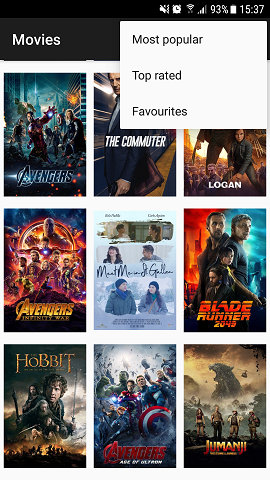
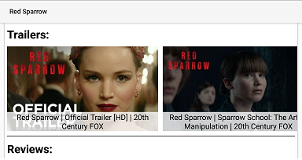

# Overview
The application for browsing movies from **themoviedb.org** website.

## Characteristic

This app is build upon the MVVM architecture, where _ViewModel_ keeps
only UI logic, while business logic is moved to presenters.

Libraries used:
* [Dagger](https://google.github.io/dagger/)
* [RxJava](https://github.com/ReactiveX/RxJava) & [RxAndroid](https://github.com/ReactiveX/RxAndroid)
* [DataBinding](https://developer.android.com/topic/libraries/data-binding/index.html)
* [Retrofit](http://square.github.io/retrofit/)
* [Moshi](https://github.com/square/moshi)
* [OkHttp](http://square.github.io/okhttp/)
* [Parceler](https://github.com/johncarl81/parceler)
* [Picasso](http://square.github.io/picasso/)
* [Mockito](http://site.mockito.org/)

In-app features:
* `RecyclerView` grid for displaying movies' posters with _Picasso_
* Hitting **themoviedb.org** API endpoints (with `Retrofit`) to display get movies' info
* Saving favorite movies to the local DB (no 3rd party ORM used)
* Displaying movie's details with the use of `CoordinatorLayout` and `ConstraintLayout`
* Starting either YouTube app or browser with the YouTube link to play movie's trailers

# Setup

To use this app you will need API key from
https://developers.themoviedb.org/3 .
    
Create a system environment variable which will be storing your API key.
The name of the variable
should be exactly `MOVIE_DB_API_KEY`. 

For Windows 7 or later you can use command  
 
    setx MOVIE_DB_API_KEY api_key_value

For Linux you can edit file 

    ~/.bash_proflle
    
and append `$PATH` with 

    export PATH=${PATH}:${HOME}/bin